# Project 2 JavaScript Essentials

# Remember Meee! Game

Remember mee! is an app that is designed to improve the short-term memory of users, both children and adults, it is a game that consists of a playing area with cards, of which you must find the pair of each card.

### External user’s goal:

The application user (Kids) wants to kill time with funny games such as memmory game Remember Meee!.

### Site owner's goal:

The application should improve your cognitive skills, short term memory and facets such as attention, creativity and visual ability.

## Surface (colors , images and fonts)
  * ### fonts from Googlefonts
      * Press Start 2P
      * Sedwick Ave Display

  * ### colors
    * backgrpund color:chocolate and cadetblue.
    * titles and name user:chocolate.
    * buttons: Cadetblue and Red. 
    * win window title:rgb(167, 226, 77).
    * others: white, black, rgb(255, 227, 67).
    
  * ### images are from.
    [Canva](https://www.canva.com/es_es/)

## Features

This game consists of two main features, firstly a game area in which the cards to be matched are found and secondly the points area where you can see the player's defeats and victories

### Existing Features

**The Remember mee! Heading and game area**

- Featured at the center of the page, the Remember mee! title and the game area is easy to see for the user. The user will be able to see the name of the game and be able to play.

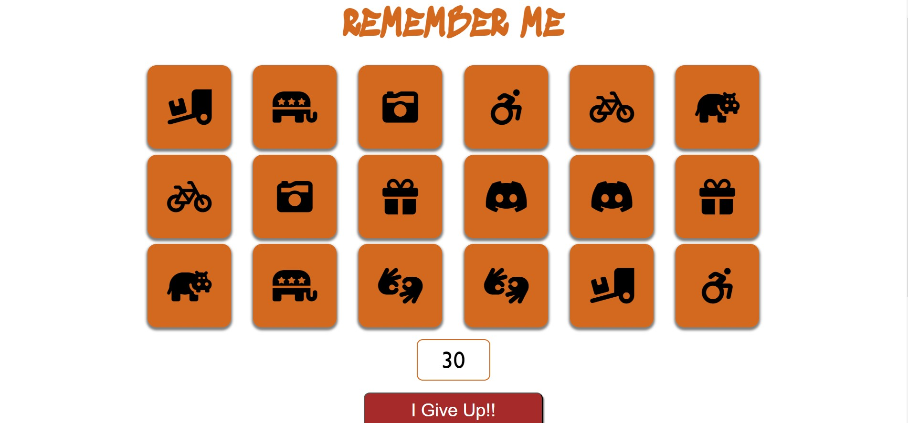

**The Game Area**

- This section will allow the user to play the memory game. The user will be able to easily see cards for 4 seconds and them they have to find each pair possible before the time runs out.
- The user will be able to give up if they want to.

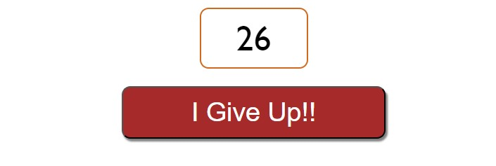

**Countdown and Give up button**

- The user only have 30 seconds to find all pairs for that there is a timer.
- The user will be able to give up, this is in case the user was not paying attention and didn't see the cards when the game started.

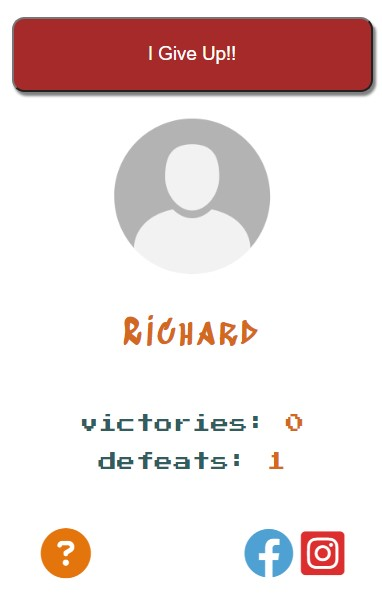

**Info Game**

- When the game starts it asks for the player's name so in this section will apear the name.

- Also you have a victories and defeats score so you can see how many game you have win or losed.

## Others Features

**Rules Window**

- When the game starts it asks for the player's name at the same time will show the rules to the user.

- The user must put some name to start playing.

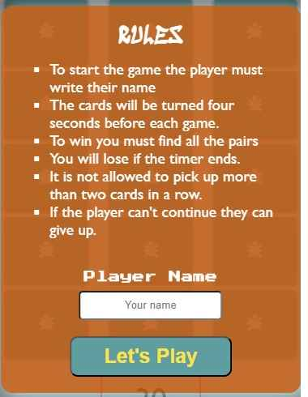

__You Lose Window__

- When the timer runs out apears the "you lose" window informing the user that they have lost the game and gives the option to start a new one

- The user must put some name to start playing.

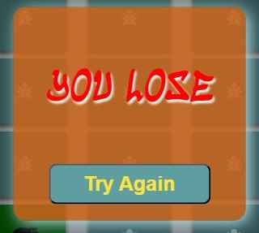

### Features Left to Implement

- level selector, so you can choose a harder or easier level depending on your ability

---

# Technologies used

### HTML5

- As a structure language.

### CSS

- As a style language.

### Java Scrpit

- As a css interactive leng to created the game area, animations and control the score games.

### Font Awesome

- As an icon library for a social links and help button.

### Google fonts

- As a font resource.

### GitHub

- As a software hosting platform to keep project in a remote location.

### Git

- As a version-control system tracking.

### Miro

- As a wireframing tool.

### Image Manipulation Program [GIMP]

- As an image editor.

---

## Testing

I used Google Chrome web developer tools and Responsively app for testing and solving problems with responsiveness and style issues.

[Responsively App](https://responsively.app/) was very helpful the diferent screen sizes are listed below:

### Cell phones

- Nokia Lumia 520 (320px - 533px)
- Nokia N9 (480px - 854px)
- Samsung Galaxy S20 (412px - 915px)
- Iphone 12 Pro (390px - 844px)

### Tablets

- Ipad (768px - 1024px)

### Desck top

- Nest Hub (1024px - 600px)
- Macbook Pro (1440px - 900px)

## Performance testing

I run [Lighthouse](https://developers.google.com/web/tools/lighthouse/) tool to check performance of the website.
I had to do couple of changes to improve performance. Screenshots are presented below:

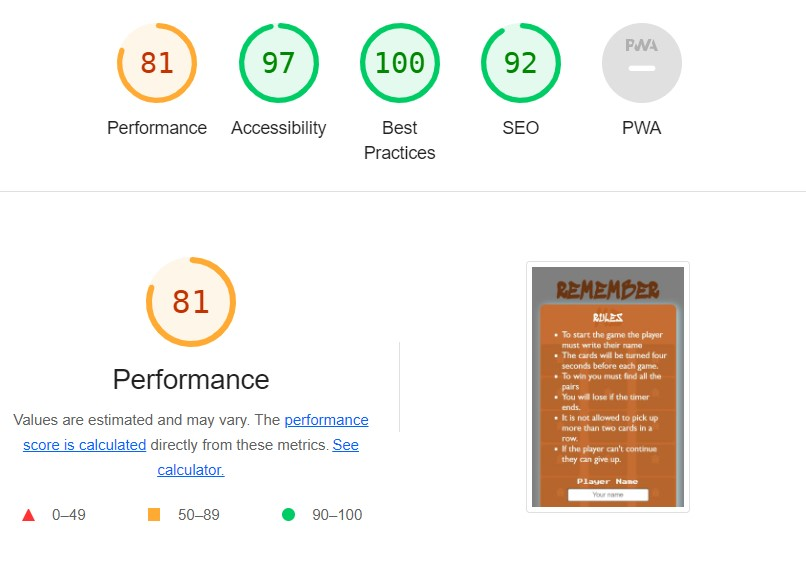

### __Final results:__

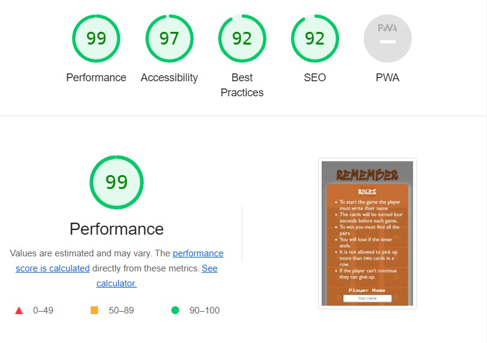
I noticed that this tests scores vary from time to time and depends on external libraries as well. 

### Validator Testing

- HTML
  - No errors were returned when passing through the official [W3C validator](https://validator.w3.org/nu/?doc=https%3A%2F%2Frichard9106.github.io%2Fremember-me-javaScript-essentials%2F)
- CSS
  - No errors were found when passing through the official [(Jigsaw) validator](https://jigsaw.w3.org/css-validator/validator?uri=+https%3A%2F%2Frichard9106.github.io%2Fremember-me-javaScript-essentials%2F&profile=css3svg&usermedium=all&warning=1&vextwarning=&lang=es)

- JavaScript - No errors were found when passing through the official [Jshint validator](https://jshint.com/) 

   __Metrics__
    -  There are 21 functions in this file.

    - Function with the largest signature take 2 arguments, while the median is 0.

    - Largest function has 19 statements in it, while the median is 4.

    - The most complex function has a cyclomatic complexity value of 3 while the median is 1.

### Unfixed Bugs

You will need to mention unfixed bugs and why they were not fixed. This section should include shortcomings of the frameworks or technologies used. Although time can be a big variable to consider, paucity of time and difficulty understanding implementation is not a valid reason to leave bugs unfixed.

# Deployment

The project was deployed on GitHub Pages. I used VsCode as a development environment where I commited all changes to git version control system.
I used push command in VsCode save changes into GitHub.

To deploy a project I had to:

* Log in to GitHub and click on repository to deploy ([remember-me-javaScript-essentials](https://github.com/richard9106/remember-me-javaScript-essentials))
* select `Settings` and find GitHub Pages section at the very bottom of the page
* from source select `none` and then `Milestone-Projects` branch.
* click `save` and page was deployed after auto-refresh.
>  Your site is published at https://richard9106.github.io/remember-me-javaScript-essentials/

To run localy:

### Firts method
* Log in to VScode account and link your repository to be open with VScode.
### Second method
* Creating a virtual space in gitHub https://github.com/richard9106/remember-me-javaScript-essentials open the repository and then click on CODE green buttom and create a virtual space.

* once it has been created you can open it with VScode directly from your virtual space.

## Credits

* To complete this project I used Code Institute student template: [gitpod full template](https://github.com/Code-Institute-Org/gitpod-full-template)

* Ideas and knowledge library:

    * [w3schools.com](https://www.w3schools.com/js/default.asp)  I used code for JavaScript set interlvar functions.

### Images:

* link images page [Canva](https://www.canva.com/)
* icons from [font Awesome](https://fontawesome.com/icons)

### Content

- The rules were created based on a Google search [memory game](https://www.google.com/search?q=memori+game+rules&sca_esv=564283140&sxsrf=AB5stBi7PJto-HcDdMO8q6vetbliEWWQPg%3A1694420047145&source=hp&ei=T8z-ZPHJBqCKkdUP9cmX-AI&iflsig=AD69kcEAAAAAZP7aX-h1ESVfbJ8kWK7u7gAfDm3kbaCl&ved=0ahUKEwixrYjIjqKBAxUgRaQEHfXkBS8Q4dUDCAs&uact=5&oq=memori+game+rules&gs_lp=Egdnd3Mtd2l6IhFtZW1vcmkgZ2FtZSBydWxlczIHEAAYDRiABDIGEAAYFhgeMgYQABgWGB4yBhAAGBYYHjIGEAAYFhgeMgYQABgWGB4yBhAAGBYYHjIGEAAYFhgeMgYQABgWGB4yBhAAGBYYHkjjIlDlCFj0IHABeACQAQCYAYABoAGuDqoBBDQuMTO4AQPIAQD4AQGoAgvCAgYQswEYhQTCAhAQLhgDGI8BGOUCGOoCGIwDwgIQEAAYAxiPARjlAhjqAhiMA8ICCxAAGIAEGLEDGIMBwgILEC4YigUYsQMYgwHCAgsQLhiABBixAxiDAcICERAuGIAEGLEDGIMBGMcBGNEDwgIIEAAYgAQYsQPCAg4QLhiABBixAxjHARjRA8ICCxAAGIoFGLEDGIMBwgIIEC4YgAQYsQPCAgUQABiABMICCxAuGIAEGMcBGK8BwgIFEC4YgATCAgsQLhiDARixAxiABMICDRAuGK8BGMcBGIAEGArCAg0QLhiABBjHARivARgKwgILEC4YgwEYsQMYigXCAg0QLhiABBixAxiDARgKwgIHEAAYgAQYCsICBxAuGIAEGArCAgcQLhgNGIAEwgIIEAAYFhgeGA_CAggQABgFGB4YDcICChAAGAUYHhgNGA8&sclient=gws-wiz)

### Media

- The photos used on the home and sign up page are from This Open Source site
- The images used for the gallery page were taken from this other open source site

Congratulations on completing your Readme, you have made another big stride in the direction of being a developer!

# Screenshots

## Project screenshots

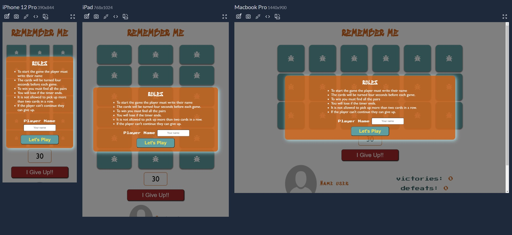
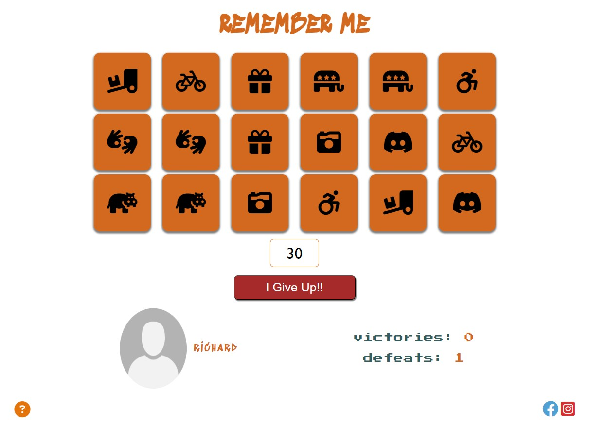
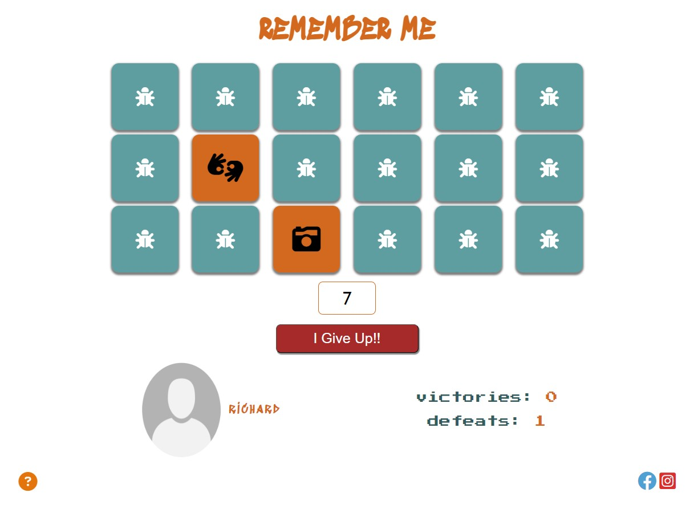
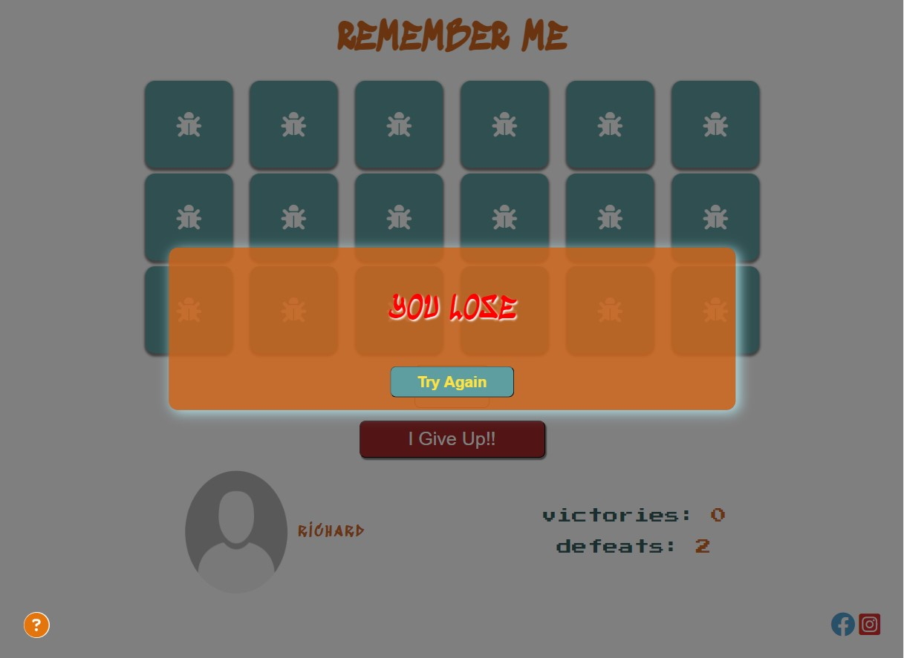
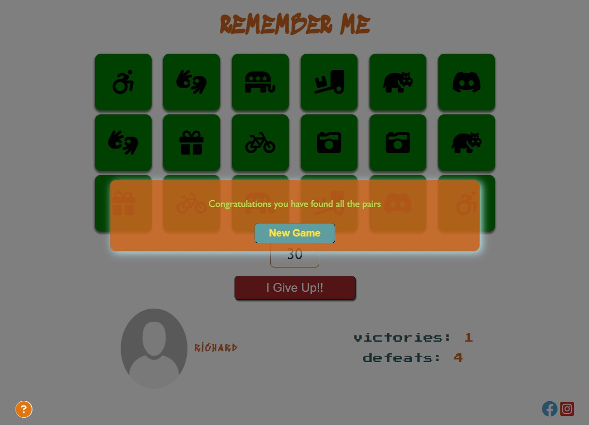
